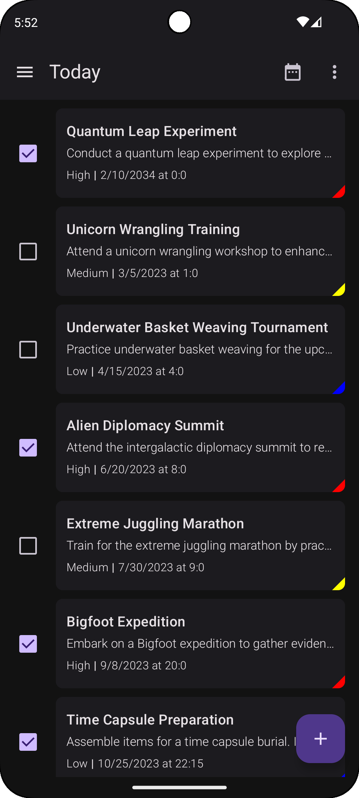
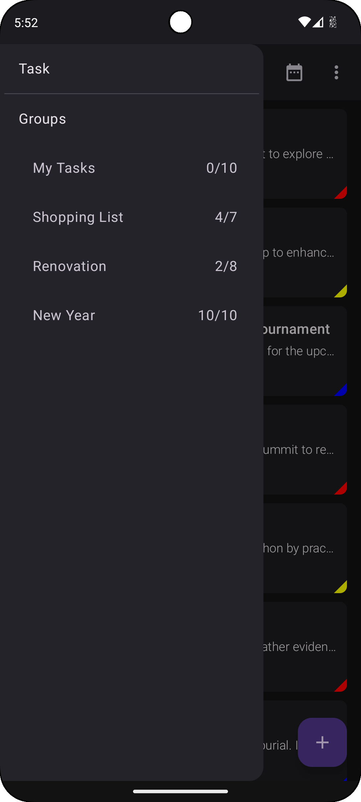
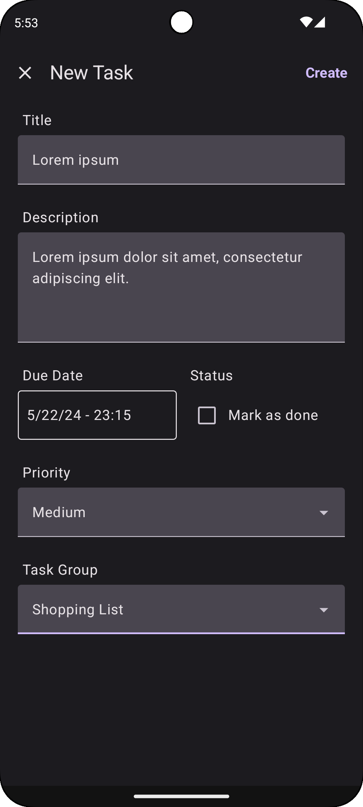
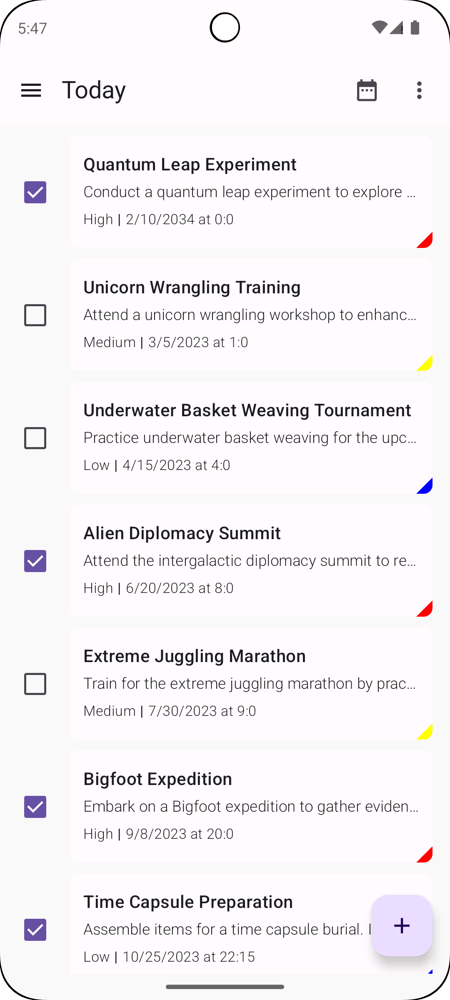
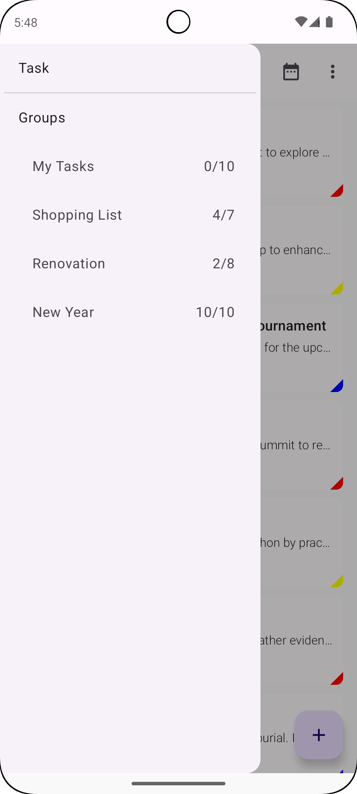
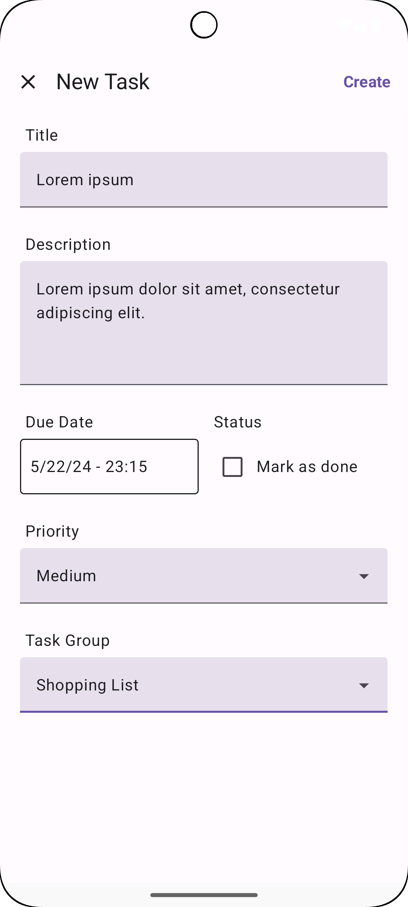

# 🚧 🏗️ In development 🏗️ 🚧

# Task
It is an offline-first, work-oriented, complexity-free, in short, **minimal** task tracking application which is part of the **Minimal Tools** app suite that I create.

## Screenshots
|:earth_americas:| :rocket:| :waning_crescent_moon:|
| ------------------------- | ------------------ | ---------------------------------------- |
|  |  | |
|  |  | |

## Used Technologies
- Kotlin
- Jetpack Compose
- Dagger
- Hilt
- Room
- Datastore
- Moshi
